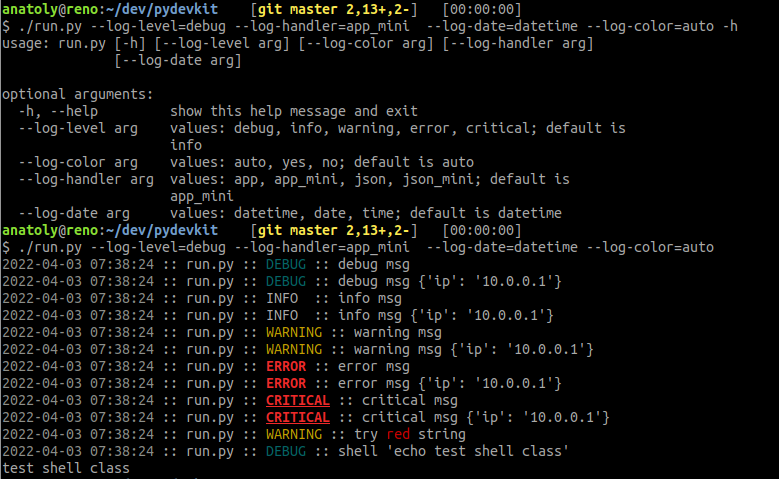

# pydevkit
This module contains helper functions useful in python develpment:
 * consistent logging format in all scripts
 * logging control via environment variables
 * logging control via command-line options
 * formatting of shell commands and collecting an output
 * ANSI colors and other terminal features
 * derive help message from documentation

To install it, run
```bash
pip3 install pydevkit
```

## Logging

This module provides an easy logging configuration.

First of all, it solves a problem of logging format consistency among different
scripts and libraries. It provides a set of usefull logging configurations and
allows you to select one at a run-time and make every instrumented script to
use it. The settings also applies to all imported modules recursivly.


Second, you can have usefull logging configuration without writing a line of
code.  No more copy-pasty-ing some usefull settings from script to script.

Third, you can select configuration via environment variables or command line
options. Again, without writing a line of code.

For example<br>



### Usage
You should add this line to the entrypoint of a script.
```python
import pydevkit.log.config
```

No need to modify any other code. It will automatically apply to all modules
using the standard approach

```python
import logging
log = logging.getLogger(__name__)
```
### Run-time options

Below is the list of a run-time logging options.
 * level - `debug`, `info`, `warning`, `error`, `critical`
 * handler - `app`, `app_mini`, `json`, `json_mini`
 * date -  `datetime`, `date`, `time` or strftime format eg `%Y-%m-%d`
 * color - `auto`, `yes`, `no`. If `auto` is selected, module will enable coloration
   for terminals and disable when output is redirected to pipe or file.
 * threads - `yes`, `no`. Include thread name in a log

To set an option use relevant `PYDEVKIT_LOG_` environment variable or `--log-`
comand-line option. For example
```bash
export PYDEVKIT_LOG_HANDLER=app
./script --log-handler=app
```

### Developer info
You can pass extra args with
```python
log.info("main text", extra={"extra": {"more": "info"}})
```

### Exrternal configuration
If `PYTHON_LOGGING_CONFIG` variable defined, it loads file var points to
and configures logging. If file ends with ".json" `dictConfig` is used otherwise
`fileConfig`.


## Argparse
Custom ArgParse wrapper featuring
 * derive help from documentation
 * auto-detect application name
 * add logging options

### Usage
Add to the entrypoint
```python
from pydevkit.argparse import ArgumentParser

def main():
    p = ArgumentParser(_help=__doc__)
    # FIXME: add args here
    # p.add_argument("--my-arg")
    Args, UnknownArgs = p.args_resolve()

```

### Add logging options
Provided `ArgParser` has all logging options and upon resolve will automatically
configure logging

### Derive help from documentation
This feature allows you to use single string, usually main `__doc__`string, to
initialize `ArgParser`. Add documentation string to the entrypoint

```python
#!/usr/bin/env python
'''
Main help message
and another line

EPILOG:
usage examples, notes etc
'''
# main code here
```

then pass it to the parser

```python
p = ArgumentParser(_help=__doc__)
```


### Auto-detect application name

This feature allows you to use script's real name in a help message, instead of
hardcoding it. It's enabled by default. To override it, pass `app_name`
parameter to the parser.

```python
p = ArgumentParser(_help=__doc__, app_name='foobar')
```

## ANSI colors

ANSI colors based on `blessing.Terminal` wrapper  and `log-color` option.  If
`auto` is selected, module will enable colors if output is terminal and disable
otherwise (redirection to pipe or file).

```python
from pydevkit.log import term_get

def main():
    term = term_get()
    log.warning("try %sred%s string", term.red, term.normal)
```


## Shell commands
TBD

## Misc
TBD
