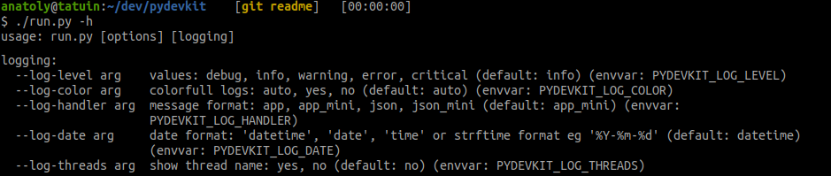
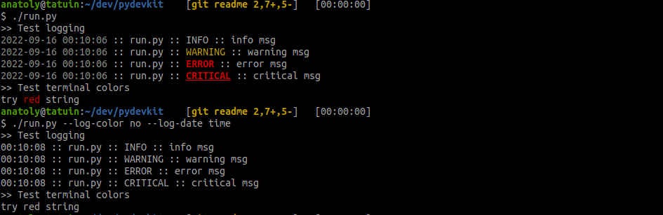

# pydevkit
Welcome to Python Development Kit.

It provides functionality, frequently needed in a python develpment:
 * logging
    * 4 predefined configurations (incl json logs)
    * control via command-line
    * control via environment variables
 * colors
    * ANSI coloration with command-line control
 * shell
    * printf-like shell command wrapper
 * argparse
    * environment-aware options with lookup order
      command line `>` environemnt `>` default
    * use module doc string as a help message
    * help formatter with switchable default and source var sections

#### Usage
To use `pydevkit` in your project, follow these steps

Install it
```bash
pip3 install pydevkit
```

Modify entrypoint to look like this
```python
import pydevkit.log.config  # noqa: F401
from pydevkit.argparse import ArgumentParser

def get_args():
    p = ArgumentParser(help=__doc__, version='1.2.3')
    # FIXME: add your args here
    p.add_argument("--file", help="file arg")

    return p.parse_known_args()

def main():
    Args, UnknownArgs = get_args()

```

No need to modify any other code. Instead, continue to use standard `logging`
module.

```python
import logging
log = logging.getLogger(__name__)
```

We're done. Now your script has working logging configuration.
<br><br>
<br>
<br>

## Logging

#### Run-time options
To control logging, you can use both `PYDEVKIT_LOG_` environment variables and `--log-`
comand-line options. For example:
```bash
PYDEVKIT_LOG_HANDLER=app ./run.py --log-level=debug
```
Here is the list of all logging options:
 * level - `debug`, `info`, `warning`, `error`, `critical`
 * handler - `app`, `app_mini`, `json`, `json_mini`
 * date -  `datetime`, `date`, `time` or strftime format eg `%Y-%m-%d`
 * color - `auto`, `yes`, `no`. If `auto` is selected, module will enable coloration
   for terminals and disable when output is redirected to pipe or file.
 * threads - `yes`, `no`. Include thread name in a log


#### Developer info
You can pass extra args to the logger with
```python
log.info("main text", extra={"extra": {"more": "info"}})
```

#### Exrternal configuration
If `PYTHON_LOGGING_CONFIG` variable is defined and points to a file, PDK will
use it to configure standard `logging` module, using `dictConfig` (for json files)
or `fileConfig` methods.


## Argparse
Custom ArgumentParserParse wrapper featuring
 * derive help (description + epilog) from single doc string
 * automatic `version` option
 * show / hide option's default value
 * show / hide option's envvar
 * built-in logging options

```python
class ArgumentParser(
      help=None, version=None, usage="full",
      show_default=True, show_envvar=True, **kwargs)
```

All standard keywords work as well. New parameters are:
 * help - gets single string, usually module's doc string,
   if `\nEPILOG:\n` is present, splits it into `description` and `epilog`,
   otherwise just `description`
 * version - if suplied, PDK adds `--version` command-line option
 * usage - when "full" or None, PDK builds standard long usage<br>
   `usage: run.py [-h] [--log-level arg] [--log-color arg] [--log-handler arg]`,
   <br>when "short" <br>
   `usage: run.py [options] [logging]`
 * show_default - add `(default: XXX)` to help
 * show_envvar - add `(envvar: XXX)` to help


#### Derive help from documentation
This feature allows you to use single string, usually main `__doc__`string, to
initialize `ArgParser`. Add documentation string to the entrypoint

```python
#!/usr/bin/env python
'''
Main help message
and another line

EPILOG:
usage examples, notes etc
'''
# main code here
```

then pass it to the parser

```python
p = ArgumentParser(help=__doc__)
```

## ANSI colors

ANSI colors controlled by `--log-color` option.
```python
from pydevkit.term import term_get

def main():
    term = term_get()
    log.warning("try %sred%s string", term.red, term.normal)
```


## Shell commands
Simple `printf`-like shell wrapper

```bash
from pydevkit.shell import Shell

sh = Shell()
sh['a1'] = 'long string'
sh['a2'] = 'long string'
cmd = 'echo %(a1)s %(a2)s'
sh(cmd)            # print stdout
txt = sh.inp(cmd)  # grab stdout
```

## Misc
TBD
